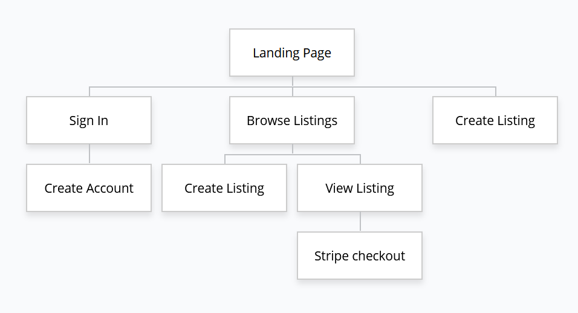
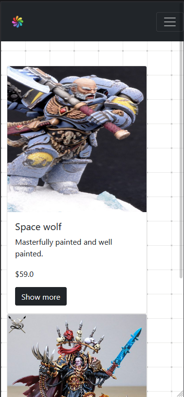
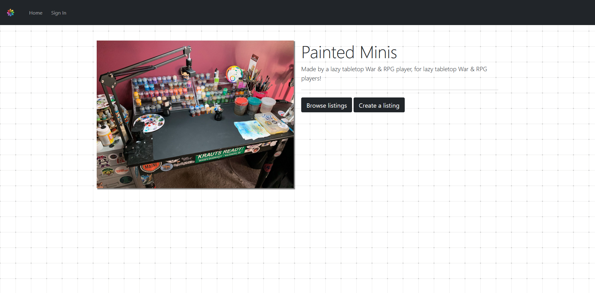
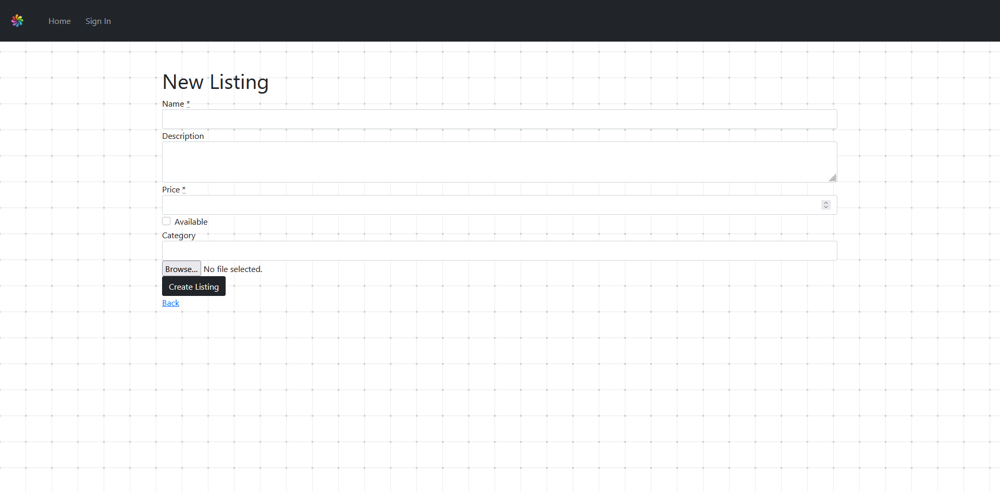
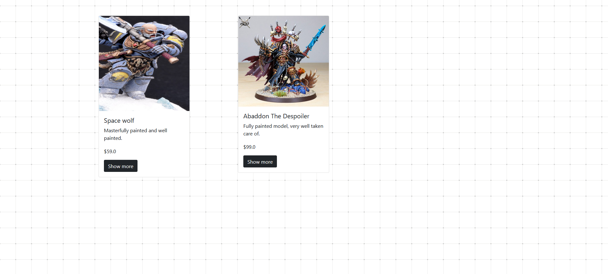
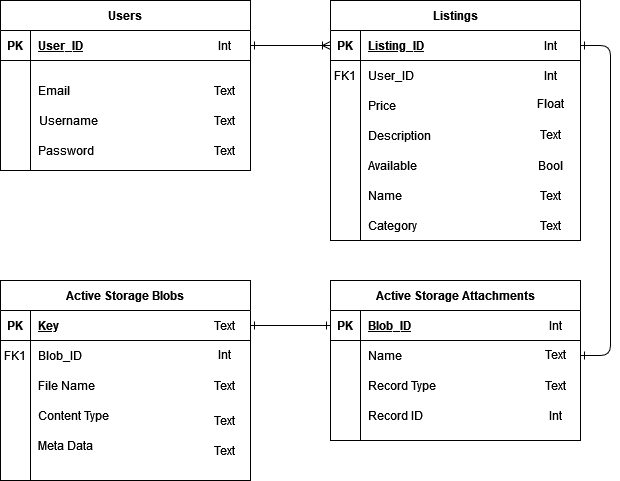
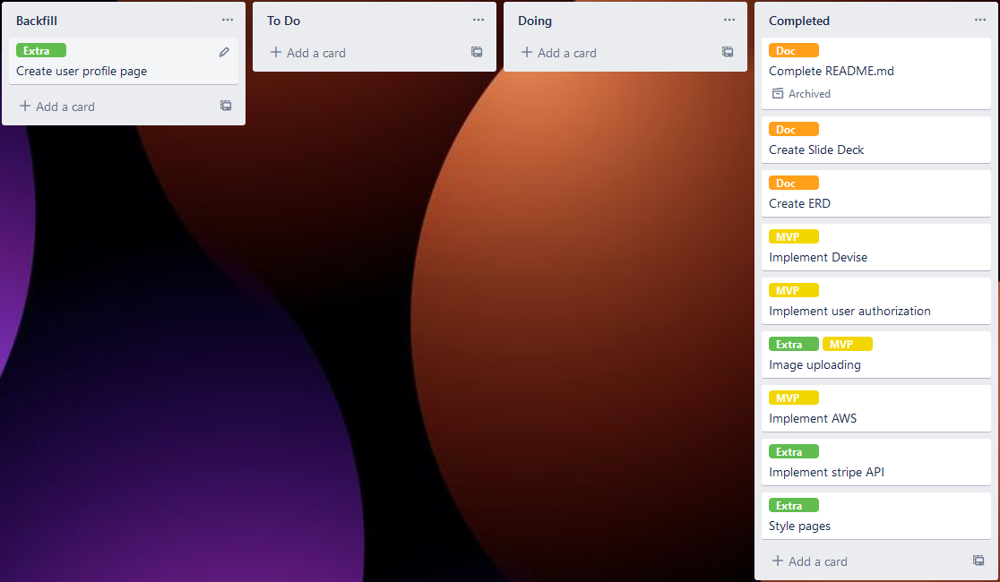

# Mitchell Boyle T2A2 Marketplace Assignment

URL: [Painted Minis - Hosted on Heroku](https://paintedminis.herokuapp.com/)

GitHub Repo: [Painted Minis - GitHub Repository](https://github.com/BroadwayAus/PaintedMinis)

# Purpose and Need
The purpose of building this app is to assist the part of the table top RPG/War game community that do not have enough time in their days to sit and paint their minis to the quality they desire, as well as those who would rather dedicate their time with the hobby into playing the game rather then learning the many technical painting techniques some mini require. This site also provides a place where talented painters can sell painted minis for extra money knowing that it will end up in the hands of someone who will appreciate the paint job.

This is needed as over the Covid-19 pandemic many table top miniature games have grown in popularity and there are no Australian website that currently support this niche market, there are currently sites that exist such as TrollTrader however this is located in the UK which makes for lengthy shipping times as well as cost inflation.

# Features
- User accounts
- Listing creation
- Authentication
- Image uploading
- Secure payment

# Sitemap

# Screenshots

# Tech Stack
- Heroku
- Bootstrap
- SCSS
- HTML5
- JavaScript
- Ruby
- Ruby On Rails
- AWS

# ERD

# Third Party Apps
- Stripe API
- Devise gem
- AWS S3 Bucket
- Simple Form gem

# Task Tracking
