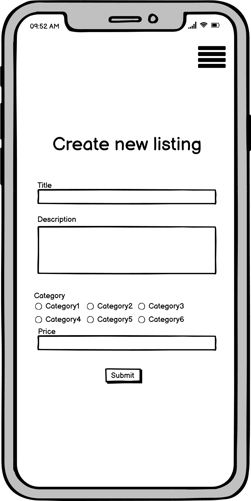

# Mitchell Boyle T2A2 Marketplace Assignment

URL: [Painted Minis - Hosted on Heroku](https://paintedminis.herokuapp.com/)

GitHub Repo: [Painted Minis - GitHub Repository](https://github.com/BroadwayAus/PaintedMinis)

# Purpose and Need
The purpose of building this app is to assist the part of the table top RPG/War game community that do not have enough time in their days to sit and paint their minis to the quality they desire, as well as those who would rather dedicate their time with the hobby into playing the game rather then learning the many technical painting techniques some mini require. This site also provides a place where talented painters can sell painted minis for extra money knowing that it will end up in the hands of someone who will appreciate the paint job.

This is needed as over the Covid-19 pandemic many table top miniature games have grown in popularity and there are no Australian website that currently support this niche market, there are currently sites that exist such as TrollTrader however this is located in the UK which makes for lengthy shipping times as well as cost inflation.

# Features
- User accounts
- Listing creation
- Authentication
- Image uploading
- Secure payment

# Sitemap

# Screenshots

# Wireframes

# Tech Stack
- Heroku
- Bootstrap
- SCSS
- HTML5
- JavaScript
- Ruby
- Ruby On Rails
- AWS

# ERD

# Schema Design

My original idea for my application was similar to AirBnB, where "Sellers" could post their unpainted minis with a price and a colour scheme that they would like their minis painted in, and a "Buyer" could collect this listing and have the minis mailed to them. Once the buyer completed the paint job it would then be mailed back. That is why in my original schema design I have a buyer and a seller table, as they would be separate because the buyers would need to be verified before being able to accept a listing. 

Another change is that I had a table for all purchased listings. The idea behind this is after a collection of listing had been sold I would then be able to take the category and price of the sold listings and create a pricing guide for user who are unsure on how much they should be paying for a paint job.

Both of these changes are to be implemented once I can create a way of verifying buyers to ensure that they will not steal the mailed minis and a way of verifying that they can indeed paint to a standard that will please the seller. Perhaps a reviews table would also be able to guide users on who they would allow to paint their minis.

# Third Party Apps
- Stripe API
    - The Stripe API allows developers to securely and seamlessly create independent "check out" instances for their users. This means that developers do not have to worry about the technical security issues that arise when processing user payments.
- Devise gem
    - The Devise gem is a widely used gem among RoR developers as it takes the hassle out of user authentication, account create and much more. In my application I used Devise to ensure that users who are not logged into an account cannot access particle pages, as well as handing account creation.
- AWS S3 Bucket
    - Amazon Web Services offers a plethora of services for developers. In my application I implemented an S3 bucket (Simple Store Service) in order to upload and store user images they that post for their listings. Via the backend I am able to pull and push images at will and not have to worry about any local servers running out of storage space.
- Simple Form gem
    - Simple Form is another popular gem for RoR developers as it streamlines the creation of Ruby embedded HTML forms, meaning it requires a lot less code to produce effect forms to POST to your Rails server.

# Task Tracking
